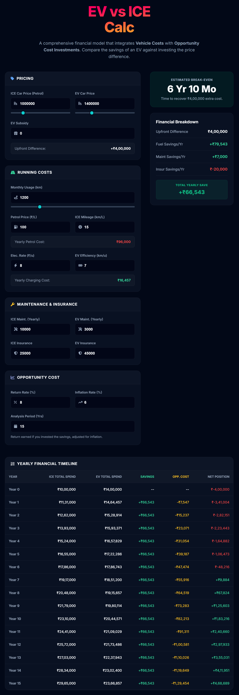
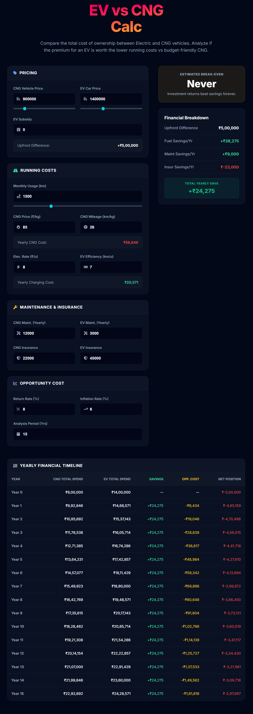
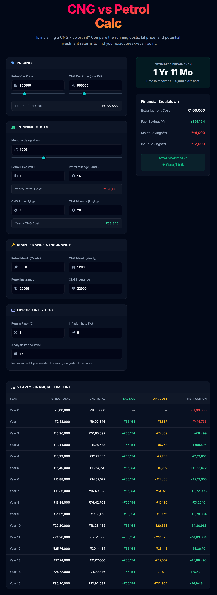

# DailyCalc
### The Comprehensive EV, CNG & Petrol Financial Calculator

> **"Should you pay more upfront for better mileage, or save on the car price and pay more for fuel?"**

---

## 📖 Introduction: The Problem with Standard Calculators
Buying a car in India has evolved beyond simple mileage calculations ("Kitna deti hai?"). With the government pushing **Electric Vehicles (EVs)** and the rising popularity of **CNG**, Indian buyers face a complex dilemma:

* **EVs:** Extremely low running cost (₹1/km) but massive upfront premium.
* **CNG:** Great mileage, but compromises boot space and increases maintenance and slightly higher price than corresponding petrol version.
* **Petrol (ICE):** Lowest upfront cost, but highest fuel expense.

Most online calculators are misleading because they only calculate **Simple Payback Period** (Fuel Savings vs. Extra Cost). They ignore the most critical factor in wealth creation: **Opportunity Cost**.

**CarsCalc** was built to solve this. It is a financial modeling tool that calculates the **Total Cost of Ownership (TCO)** by factoring in Inflation, Investment Returns, and Maintenance differentials.

---

## 🧠 The Financial Logic (How it Works)

This tool runs a professional financial model in your browser. Here is the logic breakdown:

### 1. Opportunity Cost ( The "Lost" Interest)
When you spend an extra ₹4 Lakhs to buy an EV over a Petrol car, you are not just spending that money—you are **losing the ability to invest it**.
* If you bought the cheaper Petrol car and invested that ₹4 Lakhs in a **Mutual Fund (SIP)** at 12%, it would double in 6 years.
* This calculator treats that "Lost Potential Growth" as a **cost** to the EV.

### 2. Inflation Adjustment (Real Rate of Return)
Saving ₹50,000 in fuel ten years from now is not the same as saving ₹50,000 today.
* The calculator applies a standard **6% Inflation Rate** to all future cash flows.
* It uses the **Fisher Equation** to determine the *Real Rate of Return*:
  $$Real Rate = \frac{1 + Nominal Rate}{1 + Inflation Rate} - 1$$

### 3. Cumulative Cash Flow Analysis
Instead of a simple "Yearly Saving" number, the tool plots a 15-year timeline. It checks year-by-year if the cumulative fuel savings have finally overtaken the compounding growth of the unspent capital.

---

## 🛠️ Included Calculators

The website features three distinct analysis modes to cover every buyer's dilemma:

### 1. ⚡ EV vs ICE (Petrol/Diesel)
* **Best for:** Buyers deciding between cars like *Tata Nexon EV vs Creative Petrol* or *MG ZS EV vs Astor*.
* **Key Factors:** Battery range efficiency (km/kWh), Home charging rates, and EV Subsidies.

### 2. ⛽ CNG vs Petrol
* **Best for:** Entry-level buyers deciding between *Maruti Swift CNG vs Petrol*.
* **Key Factors:** Calculates if the higher maintenance and kit cost is justified by your monthly running.

### 3. 🔋 EV vs CNG
* **Best for:** High-usage drivers (Uber/Ola/Commuters) deciding between the two "Low Running Cost" options.
* **Key Factors:** Compares the hassle of CNG queues vs the range anxiety of EVs.

---

## 📸 Interface & Screenshots

### EV vs ICE Analysis

### EV vs CNG Analysis

### CNG vs Petrol Analysis

---

## 🎮 User Guide: How to Decide on Your Car?

Follow these steps to get an accurate financial result:

### Step 1: Accurate Inputs
* **Price:** Enter the *On-Road Price*, not Ex-Showroom.
* **Subsidy:** If your state (e.g., UP, Maharashtra) has a subsidy policy, deduct that from the EV price.

### Step 2: The "Investment Slider" (Crucial)
You must define your **Opportunity Cost**. Ask yourself: *"If I didn't buy the expensive car, where would I put the money?"*
* **Select 6-7%:** If you are conservative and would keep the money in an **FD**.
* **Select 12%:** If you invest in **Mutual Funds / Stocks**.
* **Select 0%:** If you would just keep the cash in a savings account (Not recommended!).

### Step 3: Interpret the Result Badges
The calculator gives you a verdict badge. Here is what they mean:

| Verdict Badge | Financial Implication | Recommendation |
| :--- | :--- | :--- |
| **🟢 Instant Win** | The EV/CNG car is cheaper upfront (rare) or savings start month 1. | **Strong Buy** |
| **🔵 Recovering (0-5 Yrs)** | You break even quickly. The fuel savings vastly outweigh the lost investment returns. | **Buy** |
| **🟡 Neutral (5-8 Yrs)** | This is the typical car ownership cycle. You aren't losing money, but not making much either. | **Personal Preference** |
| **🔴 Long Term (8+ Yrs)** | It takes too long to recover the cost. You are better off buying the cheaper car and investing the difference. | **Avoid / Buy Petrol** |
| **🔴 Never** | The interest on the saved capital is higher than the fuel savings. The EV will *never* be financially cheaper. | **Strong Avoid** |

---

## 🔒 Tech & Privacy
* **Client-Side Architecture:** The entire calculation logic sits in `index.html` and `script.js`.
* **Zero Data Usage:** No user input, financial data, or preferences are sent to any server. Everything runs locally on your device.
* **Performance:** Built with Vanilla JavaScript (ES6) for <100ms load times, even on 3G networks.

---

## 📬 Connect
**Created by [Sudhanshu Gausinga]**

*Passionate about Technology, Finance, and building useful tools*

